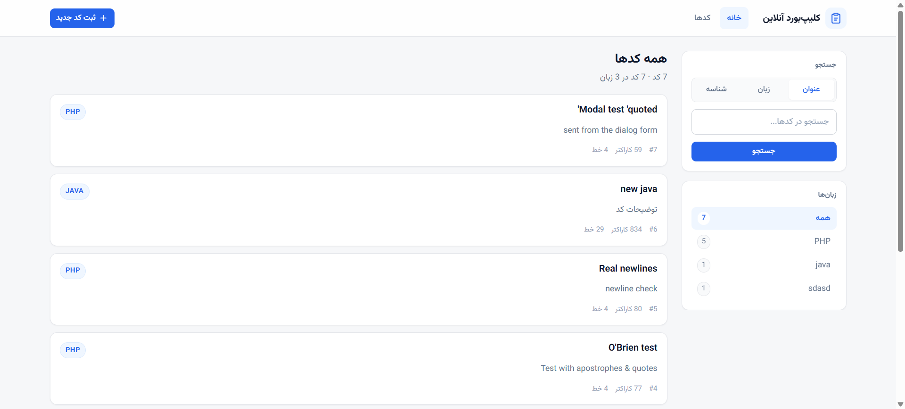

# CodePoint

> 📖 [نسخه فارسی](./README.fa.md)

A Persian (Farsi) code-snippet manager with a fully right-to-left interface — store snippets, search them, browse them by language, read them with line numbers and syntax highlighting, and edit or delete them from a custom right-click menu. Plain PHP + MySQL on Apache, no framework, no build step.



<p align="center">
  <a href="#-features">Features</a> ·
  <a href="#-project-structure">Project Structure</a> ·
  <a href="#-requirements">Requirements</a> ·
  <a href="#-contributing">Contributing</a>
</p>


## ✨ Features

### 📚 Snippet Library

- Card list showing each snippet's title, language badge, a two-line clamped description, and metadata (id, character count, line count).
- Empty-state panel when a search or filter matches nothing.
- Relative-size metadata (bytes / KB) rendered LTR-safe, so `80 B` never flips to `B 80` in an RTL document.

### 🔍 Search & Filter

- Search in three modes: by **title**, by **language**, or by **id** — chosen with a segmented control in the sidebar.
- Language filter list built from a `GROUP BY` query, each entry showing how many snippets it holds.
- Active search is preserved when you click a language filter, so filters compose instead of resetting each other.

### 💬 Code Viewer

- Dedicated `read.php?code_id=N` page with a sticky toolbar: snippet title, language override dropdown, **copy** and **copy with line numbers** buttons.
- Line-number gutter that stays aligned with the highlighted code, and a horizontal scroll area for long lines.
- Syntax highlighting via highlight.js 11.9.0 (github-dark theme) loaded from a CDN, re-applied when you override the language.
- Sidebar with the snippet's metadata and full description.

### 🖱️ Right-click Menu

- Right-clicking any snippet card opens a custom menu — **copy**, **edit**, **delete** — instead of the browser's default one.
- A per-card **"⋯" button** opens the same menu, so touch devices without a right-click get the same three actions.
- Fully keyboard-driven: `↑`/`↓` to walk the items (wrapping around), `Home`/`End` to jump, `Esc` to dismiss. Dismissing returns focus to the button that opened it.
- The menu is clamped inside the viewport and closes on `Esc`, an outside click, scroll or resize.
- Edit reuses the "new snippet" dialog in an edit mode, with the title and button text switching to **ویرایش کد** / **ذخیره تغییرات**.
- Delete asks for confirmation, then always returns to `index.php`.
- The viewer page carries the same two actions as plain **ویرایش** / **حذف** buttons, so editing is reachable without going back to the list.

### ⚙️ Interface

- Fully right-to-left layout built with CSS **logical properties** (`margin-inline-*`, `padding-inline`, `border-inline-*`) rather than hard-coded left/right.
- Hand-written design system in a single stylesheet — CSS custom properties for color, spacing, radius and shadows, with a documented class contract in the file header.
- "New snippet" form lives in a native `<dialog>` modal, so the sidebar keeps its scroll room.
- Responsive: two-column layout on desktop, stacked at `1024px`, toolbar wraps and code font shrinks at `640px`.
- Vazirmatn as the Persian UI font, falling back to `system-ui` / `Tahoma`.

### 🔒 Safety

- Every value is escaped with `SQLHelper::escape()` (`mysqli_real_escape_string`) before it reaches a query — no string interpolation into SQL.
- All rendered values pass through `htmlspecialchars()`.
- `code_id` is cast to `(int)`, so it can never carry SQL.
- `SQLHelper` wraps connection and query calls in `try/catch` for `mysqli_sql_exception`, which PHP 8.1+ throws by default.
- Delete is a **POST** through a hidden form, never a GET, so a snippet can never be removed by a crawled or prefetched link.
- The `return_to` redirect target is whitelisted to `index|read`, so it cannot be turned into an open redirect.
- The code payload handed to the menu travels in a `data-` attribute with every character escaped and newlines normalised to `LF` before being entity-encoded — a literal `CR` inside an attribute value is rewritten by the HTML parser and would otherwise turn each `CRLF` into a blank line.

## 🛠 Tech Stack

| Layer | Tool |
| --- | --- |
| Language | PHP 8.2 |
| Database | MySQL / MariaDB 10.4 (`utf8mb4_unicode_ci`, InnoDB) |
| Web server | Apache via XAMPP |
| DB access | `mysqli`, wrapped in `tools/SQLHelper.php` |
| Syntax highlighting | highlight.js 11.9.0 (CDN) |
| Font | Vazirmatn (CDN) |
| Styling | Hand-written CSS design system, CSS logical properties |
| Frontend | Vanilla JS, native `<dialog>` |
| Tooling | `php -l` for linting, Playwright for visual QA |

## 📁 Project Structure

```text
CodePoint/
├── index.php               # Home: search, language filter, snippet card list, right-click menu
├── read.php                # Viewer: line numbers, highlighting, copy + edit/delete buttons
├── api.php                 # POST endpoint: insert / update / delete a snippet
├── database.sql            # Schema: CREATE DATABASE + CREATE TABLE codes (+ optional sample data)
├── screenshot/
│   └── screenshot.png      # Screenshot used in this README
└── tools/
    ├── SQLHelper.php       # DB layer: escape(), fetchAll(), fetchOne(), sendQuery()
    ├── header.php          # Shared partial: <head>, navbar, new-snippet <dialog>
    └── style.css           # Design system (tokens, layout, components)
```

- **`index.php`** — entry point. Reads the search term and active language, builds the `WHERE` clause with escaped values, and renders the card list plus the filter sidebar. Also owns the right-click menu: one delegated `contextmenu` listener, one `click` listener, and a keyboard handler, so a single listener per event serves every card.
- **`read.php`** — the code viewer. `fetchOne()` on `(int)$_GET['code_id']`, then toolbar, gutter and highlighted body. A missing snippet redirects to `index.php` instead of rendering a broken page.
- **`api.php`** — form target for all three actions. `action` selects `insert`, `update` or `delete`; insert and update share the same validation (title, language, description and code all non-empty) and the same four escaped values. Delete takes only a `(int)` id.
- **`tools/header.php`** — included by both pages. Set `$pageTitle` and `$activePage` before including it. Also holds the shared dialog, the hidden delete form, the toast stack and `window.codePoint` (`openEditor`, `remove`, `copy`, `toast`, `clipboard`), so both pages drive the same editor.
- **`tools/SQLHelper.php`** — holds the credentials and every query helper. **Edit the connection details here first.**

## 🚀 Build & Run

There is nothing to build — no Composer, no bundler. Copy the folder into your web root and create one table.

### 1. Place the project

Copy `CodePoint/` into XAMPP's `htdocs`:

```bash
# Windows
xcopy /E /I CodePoint "C:\xampp\htdocs\CodePoint"
```

> 💡 If you keep the folder inside a `www` directory, adjust the URL in the next step — the URL mirrors the path **under the document root**, not your disk layout.

### 2. Create the database

The schema ships in [`database.sql`](./database.sql), so you can import it as-is. From the command line:

```bash
mysql -u root -p < database.sql
```

Or in phpMyAdmin (`http://localhost/phpmyadmin`): **Import → choose `database.sql` → Go**. The file is UTF-8, so Persian titles import correctly.

It creates the `code_point` database, the `codes` table, and an index on `code_lang` for the language filter:

```sql
CREATE DATABASE IF NOT EXISTS `code_point`
    DEFAULT CHARACTER SET utf8mb4
    COLLATE utf8mb4_unicode_ci;

USE `code_point`;

DROP TABLE IF EXISTS `codes`;

CREATE TABLE `codes` (
    `code_id`         INT AUTO_INCREMENT PRIMARY KEY,
    `code_title`      VARCHAR(255) NOT NULL,
    `code_text`       TEXT         NOT NULL,
    `code_lang`       VARCHAR(100) NOT NULL,
    `code_description` TEXT        NOT NULL,

    -- the language filter lists every code_lang with its count
    INDEX `idx_codes_lang` (`code_lang`)
) ENGINE=InnoDB DEFAULT CHARSET=utf8mb4 COLLATE=utf8mb4_unicode_ci;
```

> ⚠️ `database.sql` contains `DROP TABLE IF EXISTS codes` — importing it over an existing installation **erases your snippets**. It also ships three commented-out sample snippets right after the `CREATE TABLE`; uncomment that block if you want some data to look at.

### 3. Point the app at your database

Edit the connection details at the top of `tools/SQLHelper.php`:

```php
private $hostname = "localhost";
private $username = "root";
private $password = "";
private $database_name = "code_point";
```

### 4. Start the services and open the app

Start **Apache** and **MySQL** from the XAMPP control panel, then visit:

```text
http://localhost/CodePoint/
```

> 🌐 The Vazirmatn font and highlight.js load from a CDN, so the first paint needs an internet connection. Layout, storage and copying all work offline.

### 5. Verify your install

```bash
# Lint every PHP file
for f in index.php read.php api.php tools/SQLHelper.php tools/header.php; do
  php -l "$f"
done
```

## 📋 Requirements

- **PHP 8.0+** (developed and tested on 8.2). Needs the `mysqli` extension.
- **MySQL 5.7+** or **MariaDB 10.4+** (tested on MariaDB 10.4.32).
- **Apache** with a document root pointing at the folder that contains `CodePoint/`.
- An internet connection only for the CDN assets — the app itself is fully functional offline.

## 🤝 Contributing

Pull requests are welcome. If you find a bug, please open an issue with:

- what you did,
- what you expected,
- what happened instead,
- your PHP and MySQL/MariaDB versions,
- the browser you were using.

> 🔒 Security notes are especially appreciated: this project stores user-supplied code and SQL, so any escaping or XSS finding is a high priority.

---

<div align="center">

Made with ❤️ by [AmirBahadorAmiri](https://github.com/AmirBahadorAmiri)

</div>
